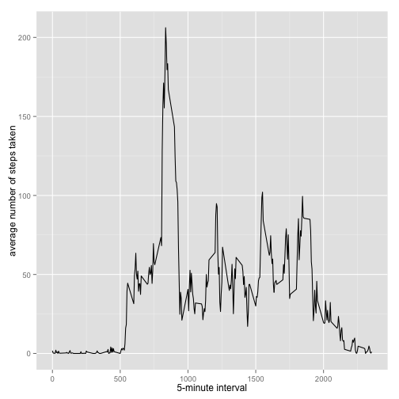

# Reproducible Research: Peer Assessment 1

## Loading and preprocessing the data

```r
data <- read.csv("activity.csv")
```
## What is mean total number of steps taken per day?
### (1) Make a histogram of the total number of steps taken each day:

```r
library(ggplot2)
total.steps <- tapply(data$steps, data$date, FUN=sum, na.rm=TRUE)
qplot(total.steps, binwidth=1000, xlab="total number of steps taken per day (excluding missing values)")
```

 
### (2) Calculate and report the mean and median total number of steps taken per day:

```r
mean(total.steps, na.rm=TRUE)
```

```
## [1] 9354
```

```r
median(total.steps, na.rm=TRUE)
```

```
## [1] 10395
```
## What is the average daily activity pattern?
### (1) Make a time series plot (i.e. type = "l") of the 5-minute interval (x-axis) and the average number of steps taken, averaged across all days (y-axis):

```r
library(ggplot2)
averages <- aggregate(x=list(steps=data$steps), by=list(interval=data$interval),
                      FUN=mean, na.rm=TRUE)
ggplot(data=averages, aes(x=interval, y=steps)) +
    geom_line() +
    xlab("5-minute interval") +
    ylab("average number of steps taken")
```

 
### (2) Which 5-minute interval, on average across all the days in the dataset, contains the maximum number of steps?

```r
averages[which.max(averages$steps),]
```

```
##     interval steps
## 104      835 206.2
```
## Imputing missing values
### Note that there are a number of days/intervals where there are missing values (coded as N). The presence of missing days may introduce bias into some calculations or summaries of the data. 
### (1) Calculate and report the total number of missing values in the dataset (i.e. the total number of rows with NAs)

```r
missing <- is.na(data$steps)
table(missing)
```

```
## missing
## FALSE  TRUE 
## 15264  2304
```
### (2) Devise a strategy for filling in all of the missing values in the dataset. The strategy does not need to be sophisticated. For example, you could use the mean/median for that day, or the mean for that 5-minute interval, etc. and (3) Create a new dataset that is equal to the original dataset but with the missing data filled in.

```r
fill.value <- function(steps, interval) {
    filled <- NA
    if (!is.na(steps))
        filled <- c(steps)
    else
        filled <- (averages[averages$interval==interval, "steps"])
    return(filled)
}
filled.data <- data
filled.data$steps <- mapply(fill.value, filled.data$steps, filled.data$interval)
```
### (4) Make a histogram of the total number of steps taken each day and Calculate and report the mean and median total number of steps taken per day. Do these values differ from the estimates from the first part of the assignment? What is the impact of imputing missing data on the estimates of the total daily number of steps?

```r
total.steps <- tapply(filled.data$steps, filled.data$date, FUN=sum)
qplot(total.steps, binwidth=1000, xlab="total number of steps taken each day")
```

 

```r
mean(total.steps)
```

```
## [1] 10766
```

```r
median(total.steps)
```

```
## [1] 10766
```
Note: Mean and median values are higher after imputing missing data. In the original data, there are many days with "steps" values as "NA" for an "interval", which are set to 0 by default for such days. However, after replacing missing "steps" values with the mean "steps"
of each associated "interval" value, these 0 values are removed from the histogram
of total number of steps taken each day and therefore calculate a higher mean and median value.

## Are there differences in activity patterns between weekdays and weekends?
### For this part the weekdays() function may be of some help here. Use the dataset with the filled-in missing values for this part. (1) Create a new factor variable in the dataset with two levels – “weekday” and “weekend” indicating whether a given date is a weekday or weekend day.

```r
weekday.or.weekend <- function(date) {
    day <- weekdays(date)
    if (day %in% c("Monday", "Tuesday", "Wednesday", "Thursday", "Friday"))
        return("weekday")
    else if (day %in% c("Saturday", "Sunday"))
        return("weekend")
    else
        stop("invalid date")
}
filled.data$date <- as.Date(filled.data$date)
filled.data$day <- sapply(filled.data$date, FUN=weekday.or.weekend)
```
### (2) Make a panel plot containing a time series plot (i.e. type = "l") of the 5-minute interval (x-axis) and the average number of steps taken, averaged across all weekday days or weekend days (y-axis). 

```r
averages <- aggregate(steps ~ interval + day, data=filled.data, mean)
ggplot(averages, aes(interval, steps)) + geom_line() + facet_grid(day ~ .) +
    xlab("5-minute interval") + ylab("Number of steps")
```

 
